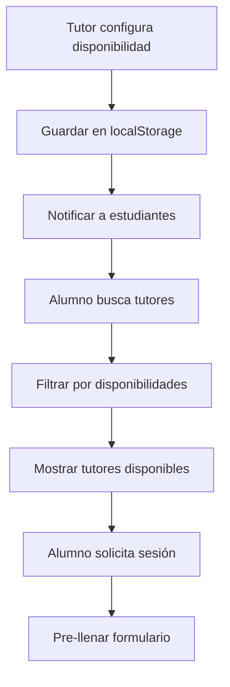

# 🔗 Integración Tutor-Alumno: Gestión de Horarios

## 📋 Descripción

Esta integración permite que cuando un **tutor** configure su disponibilidad en la sección "Gestión de Horarios", esa información aparezca automáticamente cuando los **alumnos** busquen tutores en la sección "Buscar Tutores".

## 🏗️ Arquitectura de la Integración

### 1. **Almacenamiento de Datos**
- **localStorage**: Se usa como almacén temporal para las disponibilidades de tutores
- **Clave**: `tutorAvailability` - Array de objetos con disponibilidades
- **Estructura**:
```javascript
{
  id: 'avail_001',
  tutor: 'Dr. Carlos Mendoza',
  tutorId: 'tutor_001',
  date: '2024-01-15',
  startTime: '10:00',
  endTime: '11:00',
  subject: 'matematicas',
  modality: 'Presencial',
  duration: 60,
  createdAt: '2024-01-14T10:00:00Z'
}
```

### 2. **Flujo de Datos**



## 🔧 Funciones Implementadas

### **En alumnos.js:**

#### `getAvailableTutors(filters)`
- **Propósito**: Obtiene tutores disponibles basados en disponibilidades reales
- **Parámetros**: `filters` - Objeto con filtros de búsqueda
- **Retorna**: Array de tutores con disponibilidades

#### `displayTutors(tutors)`
- **Propósito**: Muestra los tutores en la interfaz con información de disponibilidad
- **Mejoras**: 
  - Muestra número de horarios disponibles
  - Botón "Ver Horarios" para ver detalles
  - Información de próxima disponibilidad

#### `setupBookingFormWithTutorData(tutorId, tutorData)`
- **Propósito**: Pre-llena el formulario de reserva con datos del tutor
- **Características**:
  - Selecciona automáticamente materia, modalidad y hora
  - Sugiere fecha basada en disponibilidad
  - Muestra notificación informativa

#### `syncTutorAvailabilities()`
- **Propósito**: Sincroniza disponibilidades desde el backend
- **Frecuencia**: Cada 30 segundos
- **Fallback**: Usa datos locales si el backend falla

#### `listenForAvailabilityChanges()`
- **Propósito**: Escucha cambios en disponibilidades en tiempo real
- **Eventos**: Storage events y polling periódico
- **Acción**: Recarga búsqueda automáticamente

### **En tutores.js (ya existente):**

#### `saveSimpleSchedule()`
- **Propósito**: Guarda disponibilidad del tutor
- **Mejoras**: Notifica automáticamente a estudiantes

#### `displayCurrentAvailability(availability)`
- **Propósito**: Muestra disponibilidades actuales del tutor
- **Integración**: Los datos se comparten con alumnos.js

## 🎯 Características Principales

### ✅ **Sincronización Automática**
- Las disponibilidades se actualizan automáticamente entre interfaces
- Escucha cambios en tiempo real usando Storage Events
- Polling periódico como respaldo

### ✅ **Búsqueda Inteligente**
- Filtra tutores por disponibilidad real
- Muestra solo tutores con horarios configurados
- Aplica filtros de materia, modalidad, hora, etc.

### ✅ **Formulario Pre-configurado**
- Al seleccionar un tutor, el formulario se pre-llena automáticamente
- Sugiere horarios disponibles del tutor
- Reduce errores y mejora la experiencia del usuario

### ✅ **Información Detallada**
- Muestra número de horarios disponibles por tutor
- Botón para ver detalles completos de disponibilidad
- Información de próxima disponibilidad

## 🧪 Pruebas

### **Archivo de Prueba**: `test-integration.html`

Este archivo permite probar toda la integración:

1. **Crear datos de ejemplo**:
   - Tutores de ejemplo
   - Disponibilidades de ejemplo

2. **Simular flujo completo**:
   - Configuración de horarios por tutor
   - Búsqueda de tutores por alumno
   - Proceso de reserva

3. **Verificar sincronización**:
   - Cambios en tiempo real
   - Actualización automática de datos

### **Cómo usar las pruebas**:

1. Abrir `test-integration.html` en el navegador
2. Hacer clic en "Crear Tutores de Ejemplo"
3. Hacer clic en "Crear Disponibilidades de Ejemplo"
4. Abrir la interfaz de alumnos en otra pestaña
5. Ir a "Buscar Tutores" y verificar que aparecen los tutores
6. Probar el proceso de reserva

## 🔄 Flujo de Trabajo Completo

### **Paso 1: Tutor configura disponibilidad**
1. Tutor va a "Gestión de Horarios"
2. Hace clic en "Configurar Disponibilidad"
3. Completa el formulario (fecha, materia, hora, modalidad)
4. Guarda la disponibilidad
5. Los datos se almacenan en `localStorage`

### **Paso 2: Alumno busca tutores**
1. Alumno va a "Buscar Tutores"
2. Aplica filtros (opcional)
3. Hace clic en "Buscar Tutores"
4. El sistema filtra tutores por disponibilidades reales
5. Muestra solo tutores con horarios configurados

### **Paso 3: Alumno solicita sesión**
1. Alumno hace clic en "Solicitar Sesión"
2. El formulario se pre-llena con datos del tutor
3. Alumno completa detalles adicionales
4. Envía la solicitud
5. El tutor recibe la notificación

## 🚀 Beneficios de la Integración

### **Para Tutores:**
- ✅ Sus horarios aparecen automáticamente en búsquedas
- ✅ Reciben solicitudes basadas en disponibilidad real
- ✅ Menos conflictos de horarios

### **Para Alumnos:**
- ✅ Ven solo tutores realmente disponibles
- ✅ Formulario pre-configurado reduce errores
- ✅ Información clara de horarios disponibles
- ✅ Proceso de reserva más rápido

### **Para el Sistema:**
- ✅ Datos consistentes entre interfaces
- ✅ Sincronización automática
- ✅ Mejor experiencia de usuario
- ✅ Menos errores manuales

## 🔧 Configuración Técnica

### **Dependencias:**
- `localStorage` para almacenamiento temporal
- `BackendAPI` para sincronización con servidor
- `Storage Events` para comunicación entre pestañas

### **Compatibilidad:**
- ✅ Navegadores modernos
- ✅ Fallback para navegadores sin Storage Events
- ✅ Funciona sin backend (modo offline)

### **Rendimiento:**
- ✅ Polling cada 30 segundos (configurable)
- ✅ Cache local para respuestas rápidas
- ✅ Lazy loading de datos

## 📝 Notas de Implementación

1. **localStorage como puente**: Se usa localStorage como puente temporal entre interfaces hasta que el backend esté completamente implementado.

2. **Fallback robusto**: Si el backend no está disponible, el sistema funciona con datos locales.

3. **Escalabilidad**: La arquitectura está preparada para migrar a WebSockets o Server-Sent Events cuando sea necesario.

4. **Mantenimiento**: El código está bien documentado y es fácil de mantener y extender.

## 🎉 Resultado Final

Con esta integración, el sistema ahora funciona como una plataforma unificada donde:

- **Los tutores** pueden configurar su disponibilidad fácilmente
- **Los alumnos** pueden encontrar tutores disponibles automáticamente
- **El sistema** mantiene la información sincronizada en tiempo real
- **La experiencia** es fluida y sin fricciones

¡La integración está completa y lista para usar! 🚀

